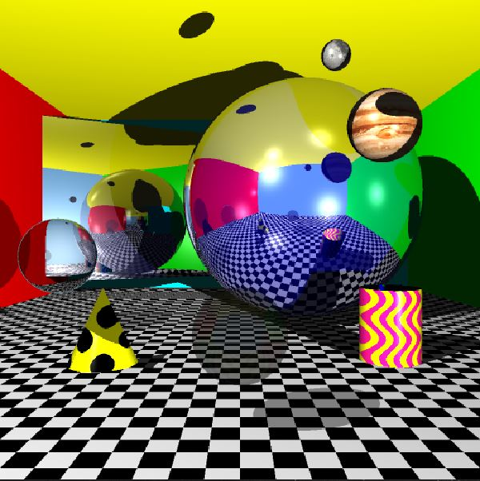

# Raytracer-Objects-and-Visual-Realism
 Implemented a ray tracer that can handle different types of geometric objects and global illumination features. The project demonstrates
 its capability in enhancing the visual realism of a rendered scene.

 
 

